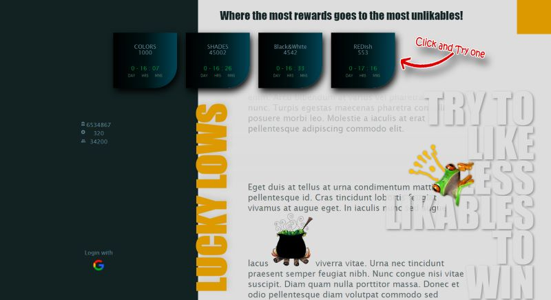
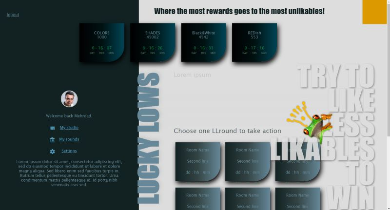
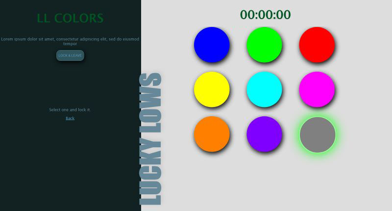

# Locky Lows
## Where the most unlikables get the most rewards!
---
### Concept:
 In Locky Lows there is many betting rounds that people can go and select whatever they like by paying an amount of their LLcoins. Each round has a certain deadline timer that after dueing, results will be published. Main idea of Locky Lows is in calculating results. The subject that has been selected more, and is more popular is LOSER! and less popular one is the WINNER! So all payed LLcoins of losers multiple by 10 will be rewarded to the winners. Also users can make and run their own rounds, using LL studio. They will collect the commision of total coins that people may be rewarded at they rounds.
 

  

You can find Locky Lows source code on Github.
*[Locky Lows source code:](https://github.com/SamiaMehrdad/Locky-Lows)*

if you want to take it a try, you can run last version here:
*[Locky Lows runing:](https://github.com/SamiaMehrdad/Locky-Lows)*

## Technical aspects :
 ### Technology:

 - Node.js
 - Express
 - MongoDB
 - JS, HTML, CSS

## Next steps :
 - Making comprehensive user guids
 - Implementing sending emails.
 - Develope betting functionality
 - Improving system manager panel
 - Implementing payment methods 
## Copyrights :
Original concept, name and logo belongs to my self and all materials and resources which may be used for development are free to download and use. 
---